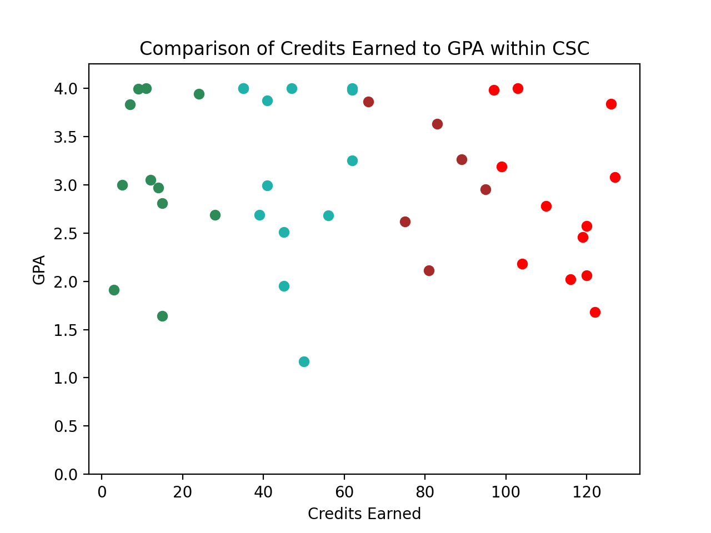
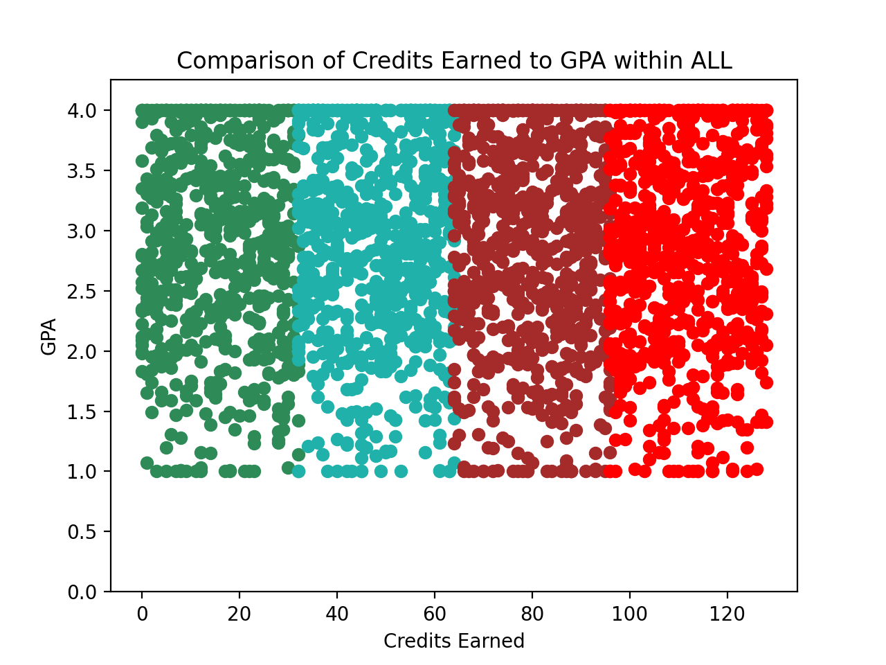

# Plotting 1

In this project you will put together a number of things you have learned:

* Lists and dictionaries
* Reading CSV files
* Use of `sys.argv`
* Plotting results

## Running the project

The project will be run from the terminal (shell). It will require 2 command line arguments.

The first is the name of the data file - in our case `studata.csv`.

The second will either be a major code or the text `ALL`.

For example:

```text
python sp.py studata.csv CSC
```

## Results

Here is a sample produced by the previous command line:



Here is a sample produced by setting major to `ALL`:



The results do not look too real but that's not the point.

## Characteristics of the chart

You will need to provide the following chart features:

* The `title` must indicate the major code given on the command line.
* The x axis shall be labeled `Credits Earned`
* The y axis shall be labeled `GPA`
* Each of the cohorts ('FF', 'SO', 'JR' and 'SR') must be drawn in specific colors.
   * 'FF' drawn in 'seagreen'
   * 'SO' drawn in 'lightseagreen'
   * 'JR' drawn in 'brown'
   * 'SR' drawn in 'red'
* The y limits must go from 0 to a 4.25 (so as to provide a little room at the top)

## Imports

```python
from matplotlib import pyplot as plt
import sys
import csv
```

## Checking for correct command line arguments

As we have done in class, you must ensure that the user has specified the correct number of arguments. For example:

```text
% python sp.py 
Please supply a file name.
% python sp.py data.csv 
Please supply a major code.
```

## Specifying a bad file

```text
% python sp.py daaa.csv CSC 
[Errno 2] No such file or directory: 'daaa.csv'
```

You must catch the `FileNotFoundError` exception into a variable. The message printed above is the contents of the variable.

## Data structure

As you're reading the data, you have to assemble a data structure:

* The top level is a dictionary whose keys will be 'FF', 'SO', 'JR' and 'SR'.
* Within each of these, there will be a dictionary. The keys will be 'x' and 'y'.
* Within each of 'x' and 'y' there will be a list:
   * 'x' must be integers (the number of credits earned)
   * 'y' must be floats (the gpa)

Hint: To make things easier, prepopulate your highest level:

```python
data = {'FF': {}, 'SO': {}, 'JR': {}, 'SR': {}}
```

This way, you will not have to do any checking to see if a key is present first before adding to it.

Remember that adding to the end of a `list` is done with `append`.

## Program structure

You should use the "proper" structure for python programs:

```python
def MainFuncion():
	pass

if __name__ == '__main__':
	MainFunction()
```

## Assumption about the data

For the purposes of this project you may assume the data is correct with no defects. Therefore, no error checking is needed. **Note: in general this is a BAD assumption.**
